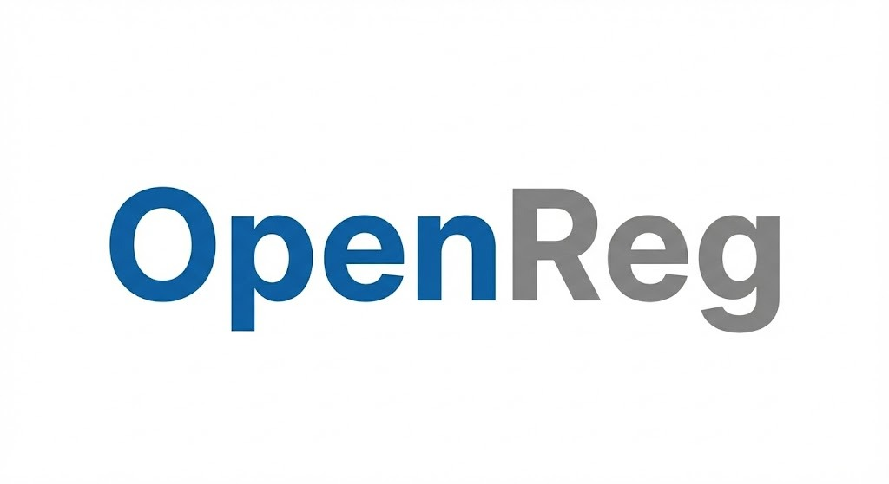

<p align="center">
  
</p>

<p align="center">
  <strong>Enterprise-Grade Regulatory Reporting Platform</strong>
</p>

<p align="center">
  <em>Automate, validate, and deliver regulatory reports with confidence</em>
</p>

<p align="center">
  <a href="https://opensource.org/licenses/Apache-2.0"></a>
  <a href="https://github.com/Hansie91/OpenReg"></a>
  <a href="https://github.com/Hansie91/OpenReg/releases"></a>
  
  
  
</p>

<p align="center">
  <a href="#-quick-start">Quick Start</a> •
  <a href="#-key-features">Features</a> •
  <a href="#-architecture">Architecture</a> •
  <a href="#-documentation">Documentation</a> •
  <a href="#-contributing">Contributing</a>
</p>

---

## Overview

**OpenReg** is a self-hosted, open-source regulatory reporting platform designed for financial institutions, trading firms, and compliance teams. It provides end-to-end automation for generating, validating, and delivering regulatory reports across multiple jurisdictions.

Built for production environments, OpenReg offers a modern web interface, robust security controls, and the flexibility to handle complex reporting requirements—from simple data transformations to sophisticated multi-source aggregations.

### Why OpenReg?

| Challenge | OpenReg Solution |
|-----------|------------------|
| Manual report generation is error-prone | Automated, repeatable workflows with version control |
| Regulatory changes require code deployments | No-code configuration for most changes |
| Multiple data sources and formats | Universal database connectivity with flexible output formats |
| Compliance audit requirements | Full audit trail with user attribution and version history |
| Complex validation requirements | Rule engine with blocking/warning validations and exception management |
| Delivery to regulators | Automated SFTP/FTP delivery with acknowledgment tracking |

---

## 🚀 Quick Start

### Prerequisites

- Docker 20.10+ and Docker Compose 2.0+
- 4GB RAM minimum (8GB recommended for production)
- Available ports: 3000, 8000, 5432, 6379, 9000

### Installation

```bash
# Clone the repository
git clone https://github.com/Hansie91/OpenReg.git
cd OpenReg

# Configure environment (optional - defaults work for development)
cp .env.example .env

# Start all services
docker-compose up -d

# Initialize the database (first run only)
docker-compose exec backend python init_db.py
```

### Access the Platform

| Service | URL | Description |
|---------|-----|-------------|
| **Web Portal** | http://localhost:3000 | Main application interface |
| **API Documentation** | http://localhost:8000/docs | Interactive OpenAPI docs |
| **Storage Console** | http://localhost:9001 | MinIO object storage UI |

**Default Credentials:**
- Portal: `admin@example.com` / `admin123`
- MinIO: `minioadmin` / `minioadmin`

> ⚠️ **Security Notice:** Change all default credentials before deploying to production. See the [Security Guide](docs/SECURITY.md) for hardening recommendations.

---

## ✨ Key Features

### Report Management

<table>
<tr>
<td width="50%">

**Declarative Configuration**
- Visual field mapping between source data and output schema
- XSD schema upload with automatic element parsing
- Support for XML, JSON, CSV, and fixed-width formats
- Configurable file naming with dynamic tokens

</td>
<td width="50%">

**Advanced Transformations**
- Python code editor with syntax highlighting
- Sandboxed execution with whitelisted libraries
- DataFrame-based data manipulation
- Cross-reference mapping lookups

</td>
</tr>
</table>

### Execution & Scheduling

- **Manual Execution** — Run reports on-demand with custom date ranges
- **Cron Scheduling** — Standard cron expressions for precise timing
- **Calendar Integration** — Business day awareness with holiday support
- **Event Triggers** — Execute based on external events or data changes

### Validation Engine

- **Pre-generation validation** — Validate source data before processing
- **Post-generation validation** — Verify output compliance
- **Exception queue** — Review, correct, and resubmit failed records
- **Validation severity levels** — Blocking, warning, and correctable rules

### Data Connectivity

| Database | Status | Notes |
|----------|--------|-------|
| PostgreSQL | ✅ Supported | Primary external database support |
| SQL Server | ✅ Supported | Windows Authentication and SQL Auth |
| Oracle | ✅ Supported | TNS and Easy Connect |
| MySQL | ✅ Supported | SSL/TLS connections |
| ODBC | ✅ Supported | Generic ODBC driver support |

### Security & Compliance

- **Role-Based Access Control** — Granular permissions for users and teams
- **Credential Encryption** — AES-256 encryption for all stored secrets
- **Audit Logging** — Comprehensive trail of all actions and changes
- **JWT Authentication** — Secure, stateless authentication
- **Multi-Tenant Architecture** — PostgreSQL Row-Level Security for data isolation

---

## 🏗️ Architecture

```
┌───────────────────────────────────────────────────────────────────┐
│                         CLIENT LAYER                              │
│  ┌─────────────────────────────────────────────────────────────┐  │
│  │                    React Web Application                     │  │
│  │              (TypeScript, Vite, TailwindCSS)                │  │
│  └─────────────────────────────────────────────────────────────┘  │
└───────────────────────────────────────────────────────────────────┘
                                │
                                │ HTTPS / REST API
                                ▼
┌───────────────────────────────────────────────────────────────────┐
│                         API LAYER                                 │
│  ┌─────────────────────────────────────────────────────────────┐  │
│  │                    FastAPI Backend                          │  │
│  │         (Python 3.11, SQLAlchemy, Pydantic)                │  │
│  └─────────────────────────────────────────────────────────────┘  │
└───────────────────────────────────────────────────────────────────┘
         │                      │                      │
         ▼                      ▼                      ▼
┌─────────────────┐   ┌─────────────────┐   ┌─────────────────┐
│   PostgreSQL    │   │      Redis      │   │      MinIO      │
│   (Metadata)    │   │   (Job Queue)   │   │   (Artifacts)   │
│                 │   │                 │   │                 │
│  • Reports      │   │  • Task Queue   │   │  • Report Files │
│  • Versions     │   │  • Scheduling   │   │  • Audit Logs   │
│  • Audit Logs   │   │  • Caching      │   │  • Backups      │
└─────────────────┘   └────────┬────────┘   └─────────────────┘
                               │
                               ▼
┌───────────────────────────────────────────────────────────────────┐
│                      WORKER LAYER                                 │
│  ┌─────────────────────────────────────────────────────────────┐  │
│  │                   Celery Workers                            │  │
│  │        (Report Execution, Delivery, Scheduling)            │  │
│  │                                                             │  │
│  │  ┌─────────────┐  ┌─────────────┐  ┌─────────────┐         │  │
│  │  │  Executor   │  │  Validator  │  │  Delivery   │         │  │
│  │  │  (Python)   │  │  (Rules)    │  │  (SFTP/FTP) │         │  │
│  │  └─────────────┘  └─────────────┘  └─────────────┘         │  │
│  └─────────────────────────────────────────────────────────────┘  │
└───────────────────────────────────────────────────────────────────┘
```

### Technology Stack

| Layer | Technology | Purpose |
|-------|------------|---------|
| **Frontend** | React 18, TypeScript, Vite | Modern SPA with type safety |
| **Backend** | FastAPI, Python 3.11+ | High-performance async API |
| **Database** | PostgreSQL 15 | Metadata, configuration, audit logs |
| **Queue** | Celery + Redis | Distributed task execution |
| **Storage** | MinIO (S3-compatible) | Report artifacts and files |
| **Execution** | RestrictedPython | Secure sandboxed code execution |

---

## 🌍 Supported Regulatory Regimes

OpenReg supports multiple regulatory reporting frameworks with active development for additional jurisdictions.

### Currently Supported

| Regime | Jurisdiction | Description |
|--------|--------------|-------------|
| **MiFIR/MiFID II** | European Union | Transaction reporting under RTS 25 |
| **UK MiFIR** | United Kingdom | Post-Brexit UK transaction reporting |

### In Development

| Regime | Jurisdiction | Status |
|--------|--------------|--------|
| **EMIR Refit** | European Union | 🔄 In Development |
| **UK EMIR** | United Kingdom | 🔄 In Development |
| **CFTC Rewrite** | United States | 📋 Planned |
| **SEC Reporting** | United States | 📋 Planned |
| **ASIC** | Australia | 📋 Planned |
| **MAS** | Singapore | 📋 Planned |
| **JFSA** | Japan | 📋 Planned |

---

## 📖 Documentation

| Document | Description |
|----------|-------------|
| [Architecture Guide](docs/ARCHITECTURE.md) | System design and component interaction |
| [Security Model](docs/SECURITY.md) | Security controls and hardening guide |
| [Deployment Guide](docs/DEPLOYMENT.md) | Production deployment with Kubernetes |
| [API Reference](http://localhost:8000/docs) | Interactive OpenAPI documentation |
| [User Guide](docs/USER_GUIDE.md) | End-user documentation |

---

## 🛠️ Development

### Local Development Setup

**Backend:**
```bash
cd backend
python -m venv venv
source venv/bin/activate  # Windows: venv\Scripts\activate
pip install -r requirements.txt
uvicorn main:app --reload
```

**Frontend:**
```bash
cd frontend
npm install
npm run dev
```

### Running Tests

```bash
# Backend tests
cd backend && pytest --cov=. --cov-report=html

# Frontend tests
cd frontend && npm test
```

### Code Quality

```bash
# Backend linting
cd backend && ruff check . && mypy .

# Frontend linting
cd frontend && npm run lint
```

---

## 📋 Roadmap

### ✅ v0.1 — Foundation (Completed)
- Web portal with authentication and RBAC
- Report management with semantic versioning
- Database connector configuration
- Report execution pipeline
- Multi-format output (XML, JSON, CSV, TXT)
- Validation engine with exception queue

### 🔄 v0.2 — Automation (In Progress)
- Schedule management (cron + calendar)
- SFTP/FTP delivery automation
- Real-time execution logging
- Enhanced monitoring dashboard

### 📋 v1.0 — Enterprise (Planned)
- Multi-tenant data isolation (PostgreSQL RLS)
- Approval workflows for report changes
- External authentication (OIDC/SAML)
- Kubernetes/Helm deployment
- Observability (Prometheus, OpenTelemetry)

---

## 🤝 Contributing

We welcome contributions from the community! Please read our [Contributing Guide](CONTRIBUTING.md) before submitting a pull request.

### How to Contribute

1. **Fork** the repository
2. **Create** a feature branch (`git checkout -b feature/improvement`)
3. **Commit** your changes with clear messages
4. **Test** thoroughly before submitting
5. **Open** a Pull Request with a detailed description

### Code of Conduct

This project follows the [Contributor Covenant Code of Conduct](CODE_OF_CONDUCT.md). By participating, you agree to uphold this code.

---

## 📄 License

OpenReg is licensed under the **Apache License 2.0**.

This license was chosen because it:
- ✅ Permits commercial use, modification, and distribution
- ✅ Includes explicit patent grant protection
- ✅ Is widely accepted by enterprise legal teams
- ✅ Is compatible with most open-source licenses

See [LICENSE](LICENSE) for the full license text.

---

## 🔒 Security

Security is a top priority for OpenReg. Key security features include:

- **Encryption at Rest** — AES-256 encryption for credentials and sensitive data
- **Encryption in Transit** — TLS 1.3 for all network communication
- **Authentication** — JWT-based with configurable session timeouts
- **Authorization** — Role-based access control with granular permissions
- **Audit Trail** — Immutable logging of all user actions
- **Code Sandboxing** — RestrictedPython with allowlisted libraries only

### Reporting Vulnerabilities

If you discover a security vulnerability, please report it responsibly by emailing [security@openreg.io](mailto:security@openreg.io). Do not open a public issue.

---

## 💬 Community & Support

- **GitHub Issues** — [Report bugs and request features](https://github.com/Hansie91/OpenReg/issues)
- **GitHub Discussions** — [Ask questions and share ideas](https://github.com/Hansie91/OpenReg/discussions)
- **Documentation** — [Comprehensive guides in `/docs`](docs/)

---

## 🙏 Acknowledgments

OpenReg is built on the shoulders of these excellent open-source projects:

- [FastAPI](https://fastapi.tiangolo.com/) — Modern Python web framework
- [React](https://react.dev/) — User interface library
- [PostgreSQL](https://www.postgresql.org/) — Relational database
- [Celery](https://docs.celeryproject.org/) — Distributed task queue
- [MinIO](https://min.io/) — S3-compatible object storage
- [RestrictedPython](https://restrictedpython.readthedocs.io/) — Secure code execution

---

<p align="center">
  <strong>Built for the regulatory reporting community</strong>
  <br>
  <sub>© 2024 OpenReg Contributors. Licensed under Apache 2.0.</sub>
</p>
