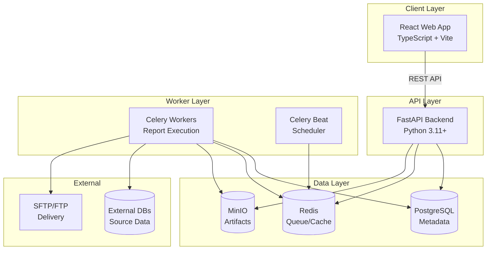
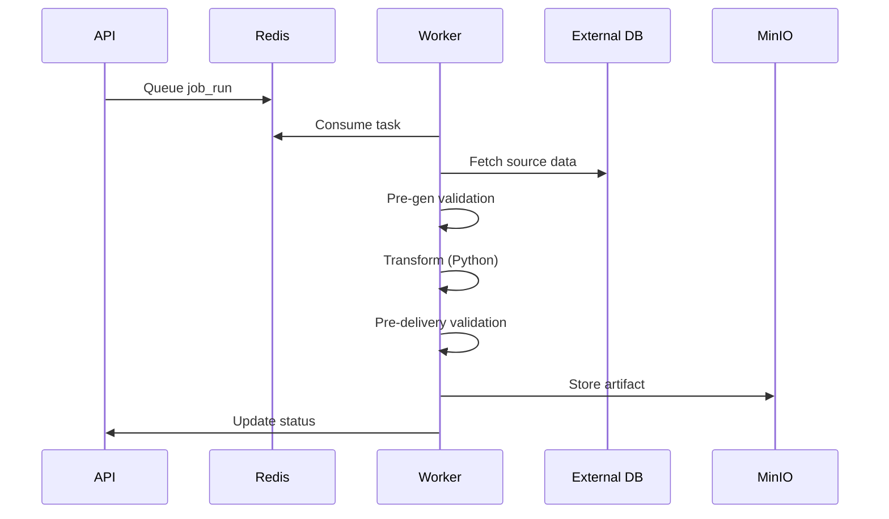
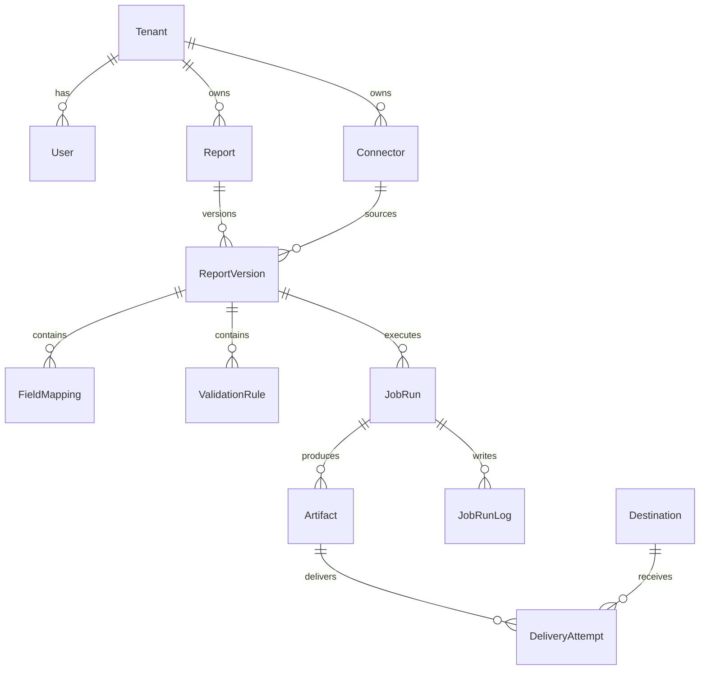
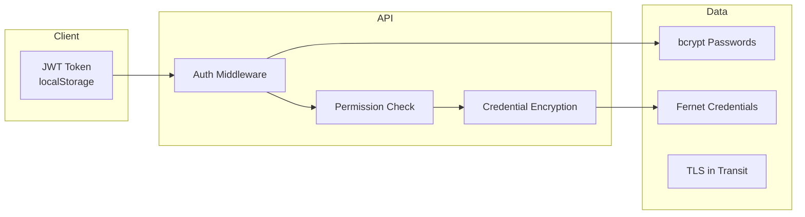

# Architecture Guide

This document describes the system architecture of OpenReg, including component design, data flows, and integration patterns.

## System Overview

OpenReg is a multi-tier regulatory reporting platform built with modern technologies for scalability, security, and maintainability.



---

## Core Components

### Frontend

| Technology | Purpose |
|------------|---------|
| React 18 | Component-based UI framework |
| TypeScript | Type-safe JavaScript |
| Vite | Fast build tooling and HMR |
| TailwindCSS | Utility-first styling |
| React Query | Server state management |
| Zustand | Client state management |
| React Router | Client-side routing |

**Key Features:**
- Protected routes with JWT authentication
- Session timeout with configurable inactivity logout
- Real-time log streaming for job runs
- Responsive design for all screen sizes

### Backend

| Technology | Purpose |
|------------|---------|
| FastAPI | High-performance async API framework |
| SQLAlchemy | ORM and database abstraction |
| Pydantic | Data validation and serialization |
| Alembic | Database migrations (planned) |
| PassLib + bcrypt | Password hashing |
| Python-Jose | JWT token handling |

**API Structure:**

```
/api/v1/
├── auth/           # Login, refresh, logout
├── reports/        # Report CRUD + versions
├── connectors/     # Database connection configs
├── queries/        # SQL query testing
├── mappings/       # Cross-reference lookups
├── validations/    # Validation rules
├── exceptions/     # Validation failures
├── schedules/      # Cron + calendar scheduling
├── destinations/   # SFTP/FTP configs
├── delivery/       # Delivery attempts
├── runs/           # Job execution history
├── submissions/    # Regulatory submissions
├── admin/          # User/role/settings mgmt
├── schemas/        # XSD/JSON schemas
├── dashboard/      # Statistics
├── xbrl/           # XBRL taxonomies
└── streaming/      # Real-time data
```

### Worker Layer

| Technology | Purpose |
|------------|---------|
| Celery | Distributed task queue |
| Redis | Message broker |
| RestrictedPython | Sandboxed code execution |

**Execution Pipeline:**



**Worker Constraints:**
- CPU: 2 cores max
- Memory: 4GB max
- Execution time: Configurable (default 1 hour)
- Only whitelisted Python libraries allowed

---

## Data Layer

### PostgreSQL (Metadata)

Stores all application metadata:



**Key Entities:**
- **Tenant**: Multi-tenant isolation boundary
- **User/Role/Permission**: RBAC system
- **Report/ReportVersion**: Semantic versioning (Major.Minor.Patch)
- **Connector**: Encrypted database credentials
- **ValidationRule**: Pre/post-generation rules
- **JobRun**: Execution history with logs
- **Artifact**: Generated report files

### Redis

- **Task Queue**: Celery message broker
- **Result Backend**: Task status storage
- **Session Cache**: (Optional) JWT blacklist

### MinIO

S3-compatible object storage for:
- Generated report artifacts (XML, CSV, JSON, TXT)
- Uploaded schemas (XSD, JSON Schema)
- Audit log exports
- Backup archives

---

## Security Architecture



**Layers:**
1. **Authentication**: JWT with 15-min access / 7-day refresh tokens
2. **Authorization**: Role-based access control with granular permissions
3. **Encryption at Rest**: Fernet (AES-128) for stored credentials
4. **Encryption in Transit**: TLS 1.2+ for all connections
5. **Sandboxed Execution**: RestrictedPython with library allowlist

See [SECURITY.md](./SECURITY.md) for complete security documentation.

---

## Scalability

### Horizontal Scaling

| Component | Scaling Strategy |
|-----------|-----------------|
| Frontend | CDN + edge caching |
| Backend | Multiple replicas behind load balancer |
| Workers | Add replicas based on queue depth |
| PostgreSQL | Read replicas, connection pooling |
| Redis | Redis Cluster or Sentinel |
| MinIO | Distributed mode across nodes |

### Connection Pooling

```python
# Backend uses per-connector pools
ConnectionPoolManager.get_pool(
    connector_id,
    db_type='postgresql',
    min_connections=2,
    max_connections=10
)
```

### Performance Considerations

- **Worker memory**: Large queries use chunked iteration
- **Artifacts**: Streamed to MinIO, not held in memory
- **Logs**: Batched writes to reduce DB load
- **Queries**: EXPLAIN ANALYZE for optimization

---

## Directory Structure

```
OpenReg/
├── backend/
│   ├── api/              # FastAPI routers (17 modules)
│   ├── services/         # Business logic
│   │   ├── database.py   # DB connection pooling
│   │   ├── executor.py   # Report execution
│   │   ├── delivery.py   # SFTP/FTP delivery
│   │   └── ...
│   ├── models.py         # SQLAlchemy models
│   ├── worker.py         # Celery tasks
│   └── main.py           # FastAPI app entry
├── frontend/
│   └── src/
│       ├── pages/        # Route components
│       ├── components/   # Shared UI components
│       ├── services/     # API client
│       └── store/        # Zustand state
└── docs/                 # Documentation
```

---

## Integration Points

### Database Connectors

Supported external databases:
- PostgreSQL (psycopg2)
- SQL Server (pyodbc)
- Oracle (cx_Oracle)
- MySQL (PyMySQL)
- Generic ODBC

### Delivery Protocols

- SFTP (paramiko) — Key or password auth
- FTP/FTPS (ftplib) — Passive/active mode

### API Clients

OpenAPI specification available at `/docs` and `/api/v1/openapi.json` for code generation.

---

## Related Documentation

- [Security Model](./SECURITY.md) — Authentication, encryption, audit logging
- [Deployment Guide](./DEPLOYMENT.md) — Production setup instructions
- [User Guide](./USER_GUIDE.md) — End-user documentation
- [Roadmap](./ROADMAP.md) — Feature development timeline
